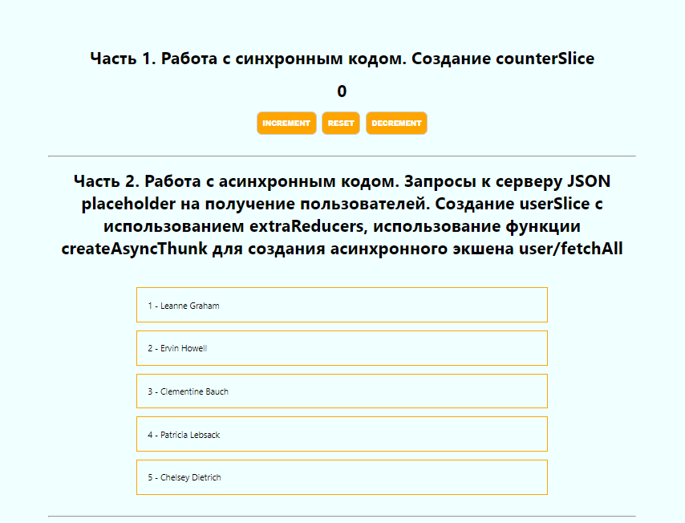
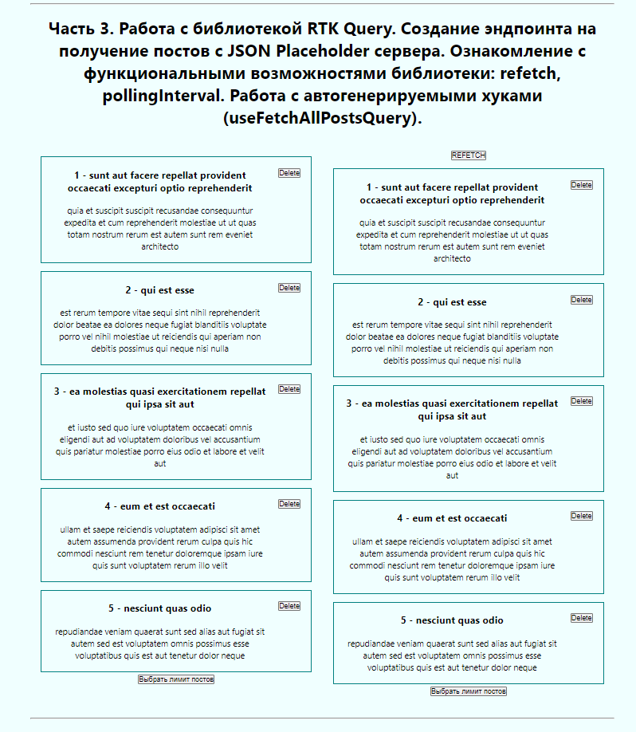
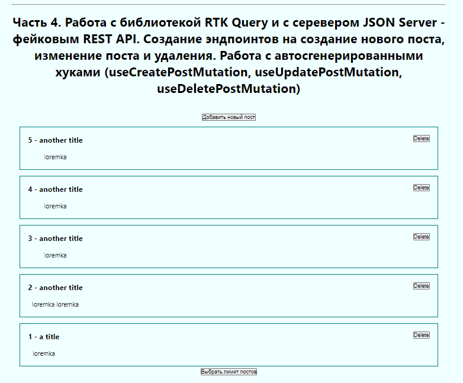

# React+redux toolkit+RTK query+typescript+ training course.
Part 1. Working with synchronous code. Creating a counterSlice.

Part 2. Working with asynchronous code. Requests to the JSON placeholder server to get users. Creating a userSlice using extraReducers, using the createAsyncThunk function to create an async action user/fetchAll.

Part 3. Working with the RTK Query library. Creating an endpoint for receiving posts from the JSON Placeholder server. Familiarization with the functionality of the library: refetch, pollingInterval. Working with auto-generated hooks (useFetchAllPostsQuery).

Part 4. Working with the RTK Query library and the JSON Server - a fake REST API. Creating endpoints for creating a new post, changing a post and deleting it. Working with auto-generated hooks (useCreatePostMutation, useUpdatePostMutation, useDeletePostMutation).
## Technologies used
* typescript
* react
* react-redux
* redux
* @reduxjs/toolkit
* RTK Query
* @types/react-redux
* JSON Server
## Visual display of the application's operation

Picture 1. Part 1 and part 2 of a work

Picture 2. part 3 of the work 

Picture 3. part 4 of the work 
