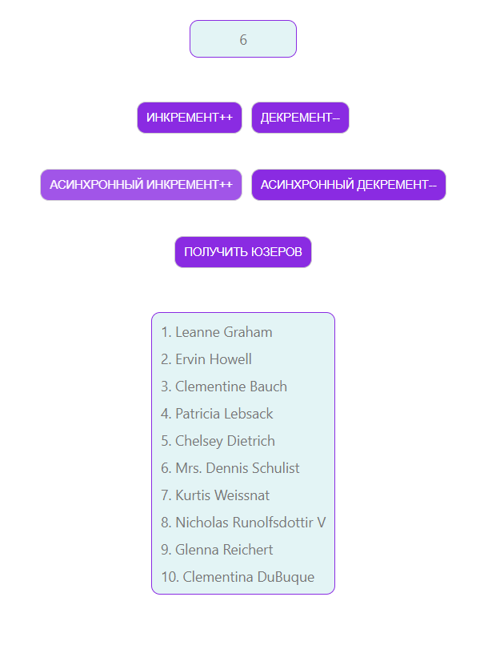

# React+redux training course. Part 2. Redux Saga.
In this part of the course, we built a simple application without validations and extensive checks. The goal of this work was to develop skills in working with React, Redux, Redux Saga, and Redux DevTools Extension. This application implements code to interact with asynchronous actions, such as artificial delay when incrementing or decrementing a counter and fetching users from a remote server, by using the Redux Saga library.

## Technologies used
* react
* react-redux
* redux
* redux-dev-tools-extension
* redux-saga
## Visual display of the application's operation
