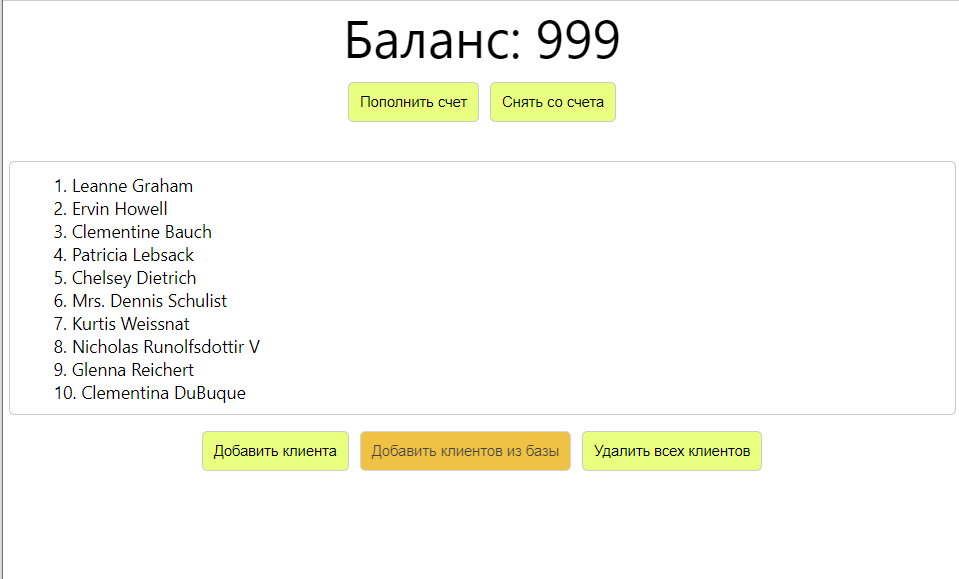

# React+redux training course. Part 1. Redux Thunk. 
In this part of the course, we built a simple application without validations and extensive checks. The goal of this work was to develop skills in working with React, Redux, Redux Thunk, and Redux DevTools Extension. This application simulates the operation of a personal account in the top section of the page. In the bottom section of the page, we can add bank clients, remove them from the list, load clients from a fake API, and also clear the entire list of clients.

## Technologies used
* react
* react-redux
* redux
* redux-dev-tools-extension
* redux-thunk
* nanoid
## Visual display of the application's operation
